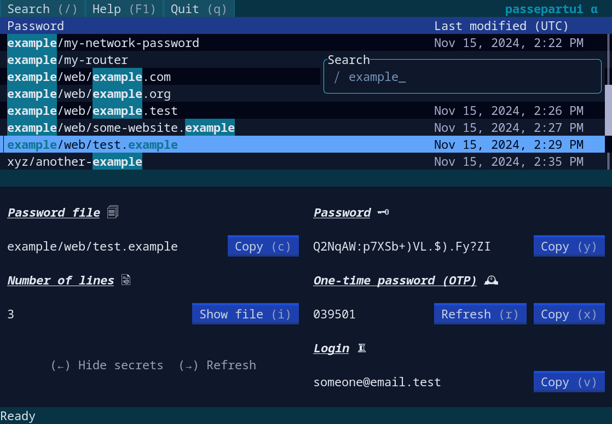

# passepartui



A TUI for pass

## Introduction

I started this project as a way to practice programming in Rust while reading the [Rust Book](https://doc.rust-lang.org/stable/book/title-page.html).
Therefore this project is still in an alpha version, however user interaction is mostly finished.

`passepartui` relies for all decryption operations on [pass](https://www.passwordstore.org/), one-time passwords (OTP) are handled by [`pass-otp`](https://github.com/tadfisher/pass-otp).
Currently no functionality for manipulating the password store, e.g. adding or deleting a password, is implemented. For those operations use `pass` directly from your terminal (refer to `man pass`).
More on the current state of development can be found below.

The name `passepartui` is a combination of "passepartout", French for "master key", and "TUI".

## Features

* Easy navigation with arrow keys and Vim keybinding
* Searching and filtering of passwords
* Support for viewing and copying operations
  for passwords and one-time passwords
* Mouse support (limited)

## Installation

### Requirements

* Unix (tested on Linux so far)
* `pass`, optionally `pass-otp` for one-time passwords
* Rust and cargo

### Installation from crates.io

`passepartui` can be found on crates.io [here](https://crates.io/crates/passepartui).

```sh
cargo install passepartui
```

Type `passepartui` to run the app (provided that `~/.cargo/bin` has been added to `$PATH`).

### Installation from the AUR

`passepartui` is available in the [AUR](https://aur.archlinux.org/packages/passepartui). You can install it with your favorite [AUR helper](https://wiki.archlinux.org/title/AUR_helpers), e.g.:

```sh
paru -S passepartui
```

### Installation from nixpkgs

`passepartui` is available in [nixpkgs](https://github.com/NixOS/nixpkgs). You
can install it in your system via the usual ways, or try it with:

```sh
nix run nixpkgs#passepartui
```

### Manual installation

Clone the repository and change to the directory:

```sh
git clone git@github.com:kardwen/passepartui.git
cd passepartui
```

Build and copy the executable to an appropriate location:

```sh
cargo build --release
cp target/release/passepartui ~/.cargo/bin
```

Run `passepartui` in a terminal.

## Contrib

The `contrib` directory contains additional files, for now an example for a desktop file.

A desktop entry lets you start `passepartui` with your application menu. Edit the desktop file `passepartui.desktop` to use your terminal emulator for running `passepartui` and copy it to `$XDG_DATA_HOME/applications` which is usually `~/.local/share/applications`.

## Development

Contributions are welcome! For architectural changes please start with opening an issue.

Build with [Ratatui](https://github.com/ratatui/ratatui)

TODO:

* General refactoring
* Tests
* Mouse support overhaul
* Localisation for last modified column
* Button animations for keyboard shortcuts

Planned for future versions:

* Background updates
* Support for symbolic links in store
* Tree view for folders (for example [Ratatui Tree Widget](https://github.com/EdJoPaTo/tui-rs-tree-widget))
* Configuration file for setting options
* Theming, e.g. for using the terminal color theme
* Decryption of password files with Rust (possibly with sequoia-openpgp).
  This would allow for
  * showing which fields are set in the password preview
  * showing all passwords at once when scrolling in the corresponding view mode (optional)
  * displaying flags for set fields in the password table
* Sorting of the password table by columns

Clippy:

```sh
rustup component add clippy
```

```sh
cargo clippy
cargo fmt
```
